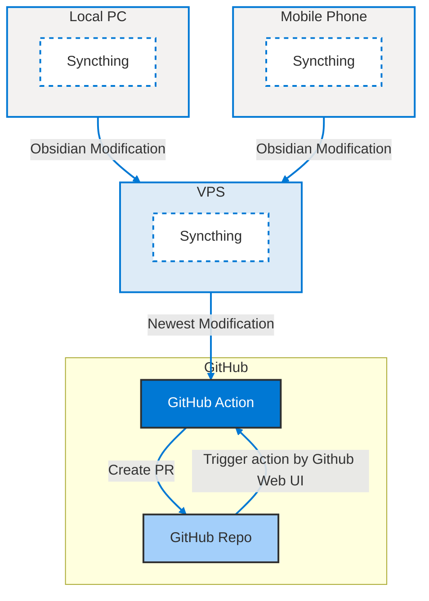

此前我曾经介绍了如何通过 Obsidian 和 Github Pages 搭建数字花园（参考[How I build my digital garden](How%20I%20build%20my%20digital%20garden.md)），虽然已经实现了更新 Obsidian 仓库来实现自动构建并且部署静态网页，但是当时更新内容仍然要通过 git 提交 commit 之后手动 push 到 Github 仓库来实现。这对于非技术人士来讲有一些麻烦，就算是对于 IT 从业者来讲，发布文章需要打开电脑通过 Linux 命令行操作，也显得不够丝滑，因此今天介绍如何通过 Github Actions 外加一台 VPS 实现通过 Github 网页按钮自动发布内容更新。

<!-- more -->
<!--truncate-->
## Overview

以下流程图展示了完整的自动发布流程，简而言之，配置好这一套系统之后，发布一篇文章的工作流如下：
- 用户在本地 Obsidian 编写文章，数据将会实时同步到 VPS
- 用户完成文章编写之后，手动触发 GitHub Actions， 从 VPS 拉取数据，自动创建 PR  等待 review 和 merge
- 用户查看 PR，确认没有明显异常，点击合入，合入后自动触发网站自动构建和部署完成发布。



_图 1：数字花园自动发布整体流程图_

该方案的核心在于一台 VPS 和 [Syncthing](https://docs.syncthing.net/) 同步软件。

一台 VPS 保证了数据可以被保存在 GitHub Actions 可以访问的地方，使得 Github Action 可以自动拉取最新的变更。

而 Syncthing 则是一个非常好用的开源同步软件，用 Golang 编写，可以方便地部署在大多数平台上面，带有简单的 web 配置界面，提供了公用的同步中继节点，但是你也可以自行搭建私有的中继节点，完全实现了安全稳定可控。安装可以参考[Syncthing 官方文档](https://docs.syncthing.net/)，使用可以参考一篇非常详尽的[文章](https://wiki.slarker.me/fnos/syncthing.html)，我目前在我的所有设备上面都安装了这个软件，实现了一些重要文件和数据的跨设备实时同步。

## GitHub Actions 配置详解

在本节中，我们提供一个具体的 GitHub Actions 配置示例，帮助用户更直观地理解自动创建 PR 的实现过程。以下配置文件展示了一个典型的工作流，该工作流在检测到仓库中有文件更新时，自动拉取最新代码、执行同步脚本，并创建 PR。

```yaml
name: Sync Files from Server

on:
  schedule:
    - cron: '0 0 1 * *'  # At 00:00 on day-of-month 1.
  workflow_dispatch: # 允许手动触发 workflow

jobs:
  sync_and_pr:
    runs-on: ubuntu-latest
    steps:
      - name: Checkout repository
        uses: actions/checkout@v4

      - name: Install rsync and ssh
        run: |
          sudo apt-get update
          sudo apt-get install -y rsync openssh-client

      - name: Set up SSH key
        run: |
          mkdir -p ~/.ssh
          echo "${{ secrets.SSH_PRIVATE_KEY }}" > ~/.ssh/id_rsa
          chmod 400 ~/.ssh/id_rsa
          ssh-keyscan ${{ secrets.REMOTE_SERVER_IP_OR_HOST }} >> ~/.ssh/known_hosts
          chmod 644 ~/.ssh/known_hosts

      - name: Sync files from remote server
        env:
          REMOTE_USER: ${{ secrets.REMOTE_USER }}
          REMOTE_SERVER_IP_OR_HOST: ${{ secrets.REMOTE_SERVER_IP_OR_HOST }}
          REMOTE_SOURCE_PATH: ${{ secrets.REMOTE_SOURCE_PATH }}
          LOCAL_DESTINATION_PATH: . # 同步到当前 repo 根目录，可以修改
        run: |
          rsync -avz --no-perms --delete -e "ssh -o StrictHostKeyChecking=no -i ~/.ssh/id_rsa" \
            "$REMOTE_USER@$REMOTE_SERVER_IP_OR_HOST:$REMOTE_SOURCE_PATH" \
            "$LOCAL_DESTINATION_PATH"

      - name: Check for changes
        id: check_changes
        run: |
          git config --global user.email "${{ github.actor }}@users.noreply.github.com"
          git config --global user.name "${{ github.actor }}"
          git add .
          git status --porcelain
          if [ -z "$(git status --porcelain)" ]; then
            echo "::set-output name=has_changes::false"
            echo "No changes detected."
          else
            echo "::set-output name=has_changes::true"
          fi

      - name: Commit changes
        if: steps.check_changes.outputs.has_changes == 'true'
        run: |
          git commit -m "auto sync from ${{ secrets.REMOTE_SERVER_IP_OR_HOST }}:${{ secrets.REMOTE_SOURCE_PATH }}"

      - name: Create Pull Request
        if: steps.check_changes.outputs.has_changes == 'true'
        uses: peter-evans/create-pull-request@v5
        with:
          token: ${{ secrets._PERSONAL_ACCESS_TOKEN }}
          branch: auto-pr # PR 的目标分支，可以修改
          title: "auto sync from Server"
          body: "auto"
          commit-message: "chore: auto sync from Server"
```

_示例 1：GitHub Actions 配置示例_

**配置详解**

1. **触发条件**：
    - `on.workflow_dispatch` 表示支持手动触发，手动触发将会是主要的触发方式，因为 obsidian 文件夹是实时更新且同步到 VPS 的，所以只有用户自己才知道什么时候内容是完成且可发布的状态。
    - `on.schedule` 设置了定时任务，每个月执行一次（利用 cron 表达式），作为一个懒人的 fallback，可以定时将内容更新更新到仓库，省去触发流程，具体的间隔可以根据个人喜好改变。
2. **环境设置**：  
	主要是安装了 rsync，ssh 等基本的工具。
3. **步骤说明**：
    - **Checkout 仓库代码**：利用官方 Action 拉取位于 github 上的 repo。
    - **设置 SSH 密钥**：通过 shell 命令配置了私钥，使得 Action 可以登录 VPS 并且拉取数据更新, 这些具体的值都存储在 Action 的环境变量和 secret 中。
    - **执行 VPS 同步脚本**：借助 rsync 命令从 VPS 上获取最新同步的数据。
    - **检查变更并创建 PR**：通过检测 git 状态判断是否存在文件更新；如果存在，则自动提交更新、推送到一个临时分支，并创建一个 PR 供 review。
