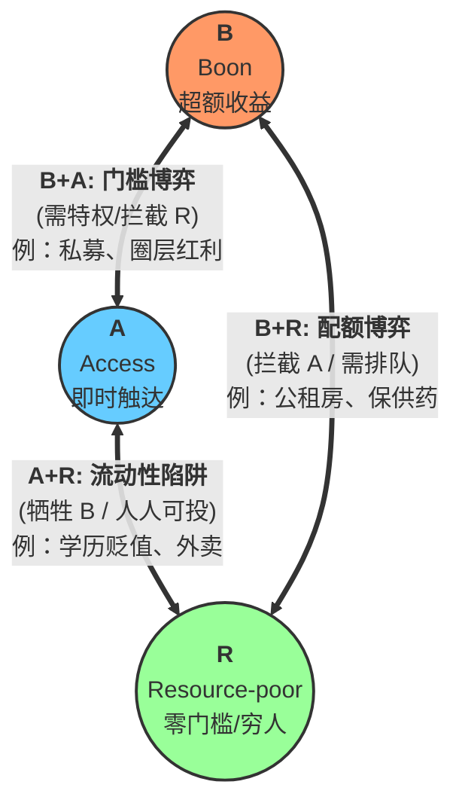

在分布式系统的领域，**CAP 定理**（Consistency, Availability, Partition tolerance）是每一位工程师入行时的图腾：它划定了物理世界的边界，告诉我们在信息交互的极限里，一致性、可用性与分区容错不可兼得。

如果我们将视角从代码仓库移开，投射到这个名为“社会”的大型博弈系统里，你会发现同样存在一个冷酷的**不可能三角**。我将其命名为 **BAR 定理**。

#### 什么是 BAR 定理？

在任何有效的博弈系统中，以下三个属性无法同时满足：

*   **B — Boon（好事 / 超额收益）**：远高于平均水平的回报，无论是金钱、阶级跃迁还是稀缺资源。
*   **A — Access（轮到你 / 可触达性）**：普通个体可以无门槛、随时随地、按需获取。
*   **R — Resource-poor（穷人友善 / 零资本门槛）**：参与者不需要具备先验的资本、人脉或特权。

#### BAR 的逻辑闭环

这个定理揭示了资源的分配策略只有三种排列组合：

1.  **B + A（好事能拿到）**：这意味着系统必须设置高昂的准入门槛。比如顶级私立学校或私募股权投资。你确实能触达超额收益，但前提是你不能是“Resource-poor”。**想要跨越门槛，参与者必须先具备资本或特权。**
2.  **B + R（为匮乏者准备的好事）**：这是典型的福利性配置，比如**公租房**。它既有实际收益（B），又面向低门槛群体（R），其结果必然是牺牲触达性（无 A）。稀缺导致了漫长的排队、摇号或者配额制度。**好事是真的，但轮到你是不确定的。**
3.  **A + R（人人可投、门槛极低）**：当一个东西标榜着高收益（伪 B），却又让所有人都能轻松参与且没有门槛时，它本质上是一个**流动性陷阱**。最典型的例子是**学历贬值**。当本科甚至研究生学历变得人人可触达且门槛极低时，其作为“超额收益（B）”的属性便迅速坍塌，最终沦为系统性的冗余。

#### 工业级的生存建议

理解 BAR 定理的意义不在于抱怨系统的不公，而在于对“博弈”本身祛魅。

当一个机会被包装成“A+R”送到你面前时，你应该立刻警觉——**如果它既不需要你有钱，又让你唾手可得，那么它极大概率不含任何 Boon。** 

现代社会的绩效主体往往陷入一种“平庸的忙碌”，本质上是在 A+R 的泥潭里试图通过勤奋刷出 B 的效果。然而定理告诉我们：**系统的底层逻辑不支持这种运气。** 

要么积累资本去置换 B+A 的入场券，要么付出耐心在 B+R 的赛道里等待配额，最危险的，莫过于在 A+R 的幻象中，消耗掉自己唯一的原始资本。

--- 
