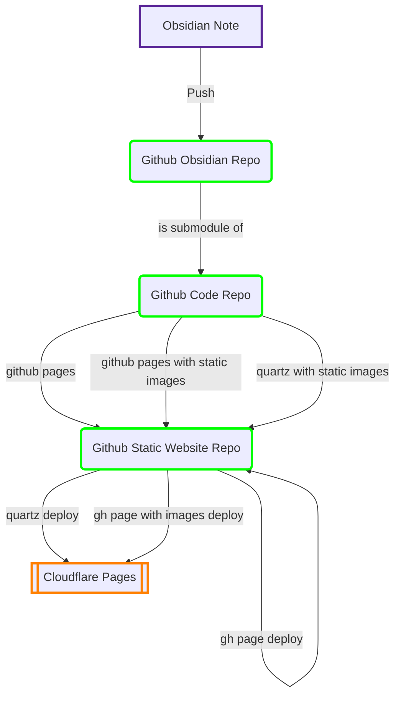

在web2.0早期的时代，我想第一次打开互联网的人都会有一个想法：我如何才能让我的信息发布在网络上？

所以我们开始使用贴吧去和孙笑川争论，使用土豆网发布诺基亚手机录制的无聊的视频。这些信息在发布以后，都会在互联网上被搜索引擎收录，所有人都有可能看见。

<!-- more -->
<!--truncate-->

随着移动互联网时代的到来，这种情况有了改变，由于人们发现了这些普通用户发布的信息背后巨大的商业价值，所以逐渐让这些信息变得封闭，你发送的信息会被审核，会被无缘无故的删除（百度贴吧删除了实名认证之前的所有信息），同时也不可能在公开的搜索引擎上被检索，不能在其他的网页上被引用。这个时候我们才发现，原来我发送的这些信息不属于我自己。

## 什么是数字花园？

所以这个时候技术圈里面又开始流行起了web1.0时代的东西，就是每一个人自己开办一个博客网站，然后在网站上发布信息。而在这个过程当中就产生了一种新的个人网站的形式：数字花园。关于它到底是一个什么东西，我想没有什么比下面这一篇文章讲的更透彻。

[产品沉思录-什么是数字花园（Digital Garden）](https://pmthinking.notion.site/Digital-Garden-effa3aa294af4d07ac279e74aec69602)

文章里提到了“溪流”和“花园”两个隐喻，我们当今使用的大部分的服务，例如小红书，今日头条，推特，包括个人博客，都是一种线性的信息流，信息流经你的脑袋，然后就被遗忘，并且永远不会再提起，因为这些信息之间只通过一个与信息本身毫不相关的时间轴串联在一起。而花园则是由许多的元素构成，你会不断的在花园里面种植新的花朵，修剪老去的叶片，你会修建很多错综复杂的小路，方便你在花园里观赏每一朵花。如果以比较抽象的计算机理论来描述这两种形式，信息流就是由链表表达，而数字花园则是一个图（ Graph）。

## 笔记软件和数字花园

这些年笔记软件是软件领域一个非常活跃的类目，几年时间内涌现了非常多各有特色的笔记产品。有北欧左人公司开发的anytype，网红开源项目Logseq, 美国创业公司推出的 SaaS笔记服务 Notion, 赛里斯创业公司开发的 AFFiNE, 基于 Markdown 格式文件的 Obsidian等等。这些笔记软件和传统的笔记软件最大的区别就是都支持很方便的互相引用功能，这使得本来像溪流一样线性流动的笔记，变得像花园一样通过一些错综复杂的小路连接起来。这也就更加方便了数字花园的构建, 这些笔记软件都有一些官方的或者社区支持的工具，可以将你的笔记很轻松地发布在互联网上，这样你的笔记就和互联网上的一个网站一一对应起来，你通过编辑笔记来更新网站内容，而你所有的信息都在你的笔记里文件里面，不再属于任何大型技术公司。

在这些笔记软件之中，我是 Obsidian 的忠实用户，他虽然不开源，但是提供免费版本，且该软件用户体验较好，有丰富的插件生态。最关键的是他基于 Markdown 格式，通过操作系统的文件夹组织你的数据，不会将你的文件转换成特殊格式存入专用的数据库内。这样一来，就算某天不再使用这个软件，你只需要把它用于保存应用数据的那个文件夹删掉，你的笔记文件依然是可以用通用的文本编辑器打开操作的。相比而言其他开源产品有些是使用了自己的特殊数据格式，有些则是客户端用户体验奇差无比，有些是无法做到全平台通用，还有很大的进步空间。

## 溪流旁边的花园

溪流和花园之间并不是东风压倒西风，也不是西风压倒东风，而是各有其优势和侧重点。当你在使用溪流类的互联网媒体的时候，你主要是在发布自己的观点和见解、阅读新鲜有趣的内容; 而当你开始构建一个花园，你更加倾向于去学习互联网上有用的的知识，收集有价值的信息。在此之前我有一个个人的静态博客，是通过Docusaurus搭建的, 这个框架本来是一个文档网站生成工具, 自带一个博客插件，而我则主要使用了它的博客功能。如果同时将其文档功能充分利用，那么由树形结构管理的文档，实际上就已经有了一些花园的雏形。因此，我基于这个博客构建了一个溪流旁边的花园。

这个花园实际上离真正的花园还有一定的距离，因为Docusaurus这个工具并没有实现构建花园比较需要的双向链接功能，也许在某一天会被官方实现，但是在这之前，我只能减少对双向链接的依赖。如果页面上出现了双链语法，则不能正常跳转，可以使用双层方括号中的关键字对站点进行搜索到达目标页面。

## 使用 Quartz 构建全功能的数字花园

[Quartz](https://github.com/jackyzha0/quartz)是一个专用的数字花园构建工具，你只需要提供一个用文件夹组织好的 Markdown 笔记，存入 Quartz 的指定目录下，然后对它进行一定的个性化设置，就可以通过一条命令构建出一个静态网页形式的数字花园，然后你就可以将这些构建出来的静态网页部署到任何地方去。

## 构建和部署

为了同时支持Quartz和Docusaurus，我在一个Github Repo里面同时存储了这两个静态网站生成程序的代码，然后将自己的笔记文件夹推送到Github Repo, 将笔记Repo添加为程序Repo的子模块，通过一些构建脚本，将目录文件进行合理转换，两者就都可以正常的构建出静态网页文件。
然后我选择将两者都部署到 Cloudflare，因为这样可以利用其提供的CDN能力，增强网站可访问性。

## 图片问题

实际上你的笔记库如果只有文本信息的话，体积会非常小巧，大约为几十MB级别，但是如果加上了图片，很容易就会扩大到数百兆甚至GB级别。在个人网站当中保存图片，一般会使用到对象存储系统，而是对象存储系统是需要定期付费的， 虽然费用不多，但对于一个不以盈利为目的网站来讲，还是有点不合算。而国外也有免费的图像存储和分享网站（图床）Imgur，所以我选择将自己的所有可以公开的图片都存储在这个网站上面, 然后在笔记内只存储这个图片的超链接, 这样笔记库总体会非常的小巧, 也不会影响阅读体验，因为Obsidian本身是可以解析图片超链接的，阅读起来和在本地存储图片没有任何区别。
但是这里就会有一个严重的问题，Imgur 这个网站在赛里斯是不可访问的, 如果不使用特殊的网络链路的话，用户看到的网页就会没有任何图片。

为了解决这一个问题，我写了一个简单的小脚本，在文本当中抽取出了所有图片链接，将其下载到我的一个闲置的小服务器上面，使用 Caddy 开了一个HTTP文件服务器, 在网站构建的过程当中, 会通过这个缓存服务器下载所有的图片，然后构建一个包含静态图片资源的网站专供赛里斯访问。之所以要使用这个缓存服务器，是因为Imgur对于下载请求是有频率限制的，大约是一分钟20次，如果完全通过Imgur下载静态图片构建网站，那构建时间就会因为下载而变得很长，同时构建失败概率也会大大增加。

## 架构图

以上就是这个项目的整体架构图，通过一个工作流，简单解释它的运作过程: 
- 我写了一篇新的笔记
- 然后将笔记文件夹推送到Github上面的笔记仓库
- 笔记仓库接收到更新以后自动触发Github Action开始构建新版本的网站，在这个仓库当中，我在Action当中定义的行为是让他触发代码仓库进行多版本同时构建
- 代码仓库接收到Action执行命令以后，就会拉取最新的笔记，并行的开始构建，分别构建一个Quartz站点，一个有静态图的Docusaurus站点，一个普通的Docusaurus站点。构建完成以后，静态网站的文件将会就会推送到发布仓库。
- 发布仓库内有一个分支会直接公开发布在在github pages服务，同时我对这个仓库配置了 Cloudflare发布服务, 这个服务分别会取出Quartz和Docusaurus with Images 分支的静态文件发布在Cloudflare服务上面。

至此三个网站全部都完成了更新，并且已经成功发布在互联网上。

值得注意的是，在这个过程当中，我手动完成的事情就是编辑 Obsidian 笔记，并且将它推送到 GitHub上面，剩下的过程全都是自动化完成的，网站的更新工作流已经变得足够简单。同时整个过程中，需要付费的只有我自己为了解决图片问题配置的缓存服务器，如果你直接在笔记中存储图片，那么这个缓存服务器也是没有存在必要的，所以这个方案是可以做到完全免费运行的。

这个方案也有如下一些特性:
- 网站的内容和生成逻辑实现分库存放，因为内容是频繁变动更新的，而生成逻辑变化频率较低
- 内容仓库和网站生成逻辑的更新均能触发网站重新构建

至此这个数字花园就已经完全搭建完成了，接下来需要做的事情就是常常的去更新完善，用自己的一生去装点这个花园。

