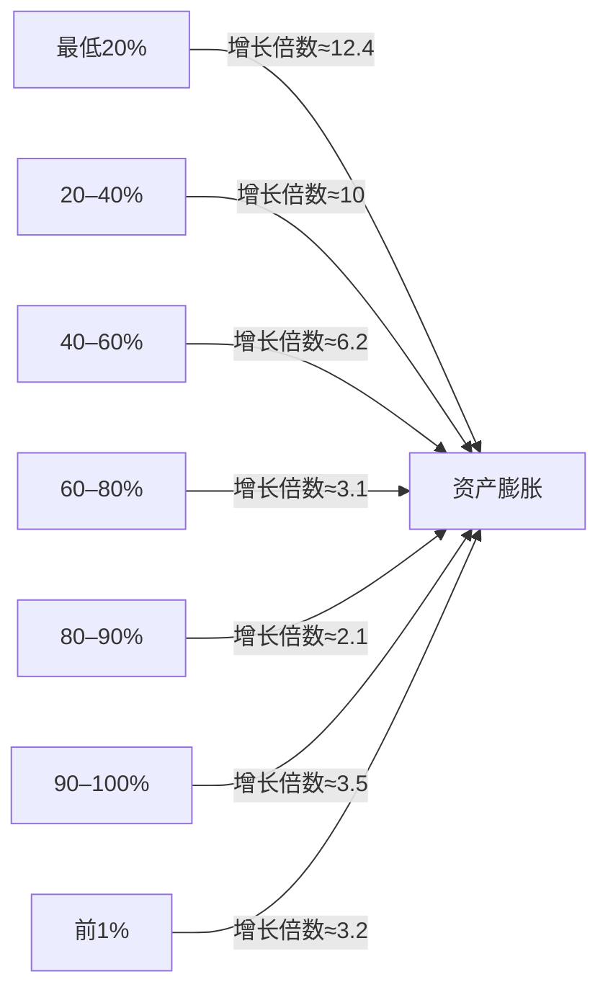
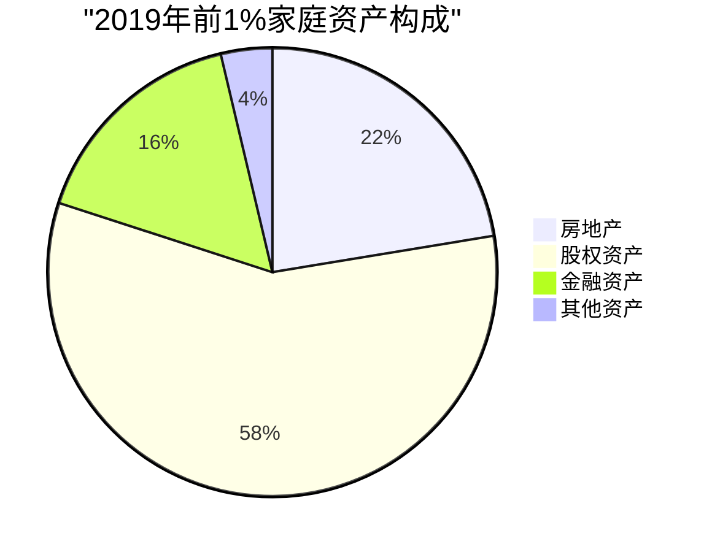
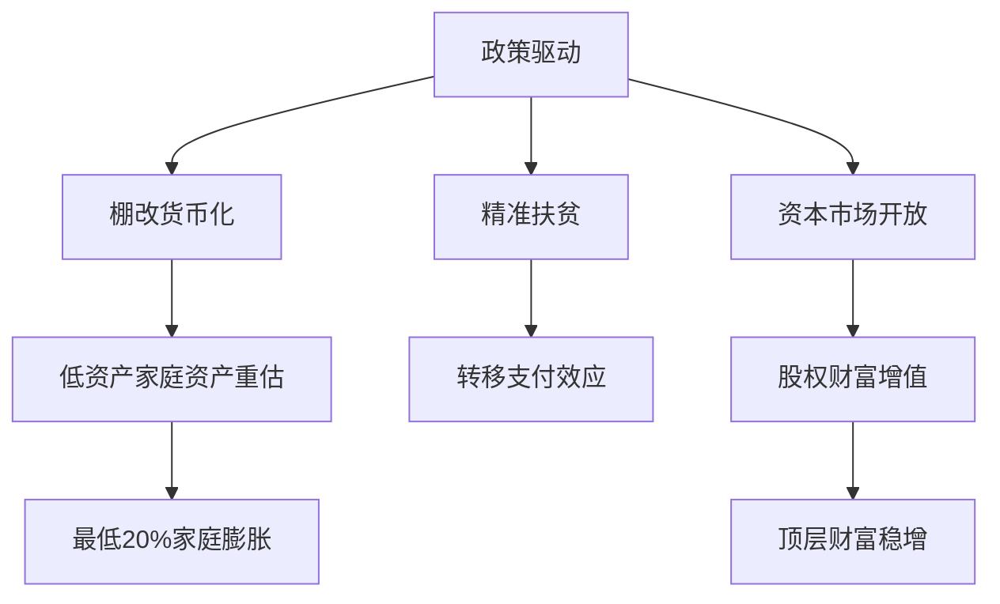

> 注： 纯 AI 生成，请勿偏听偏信

下面给出一份详细的学术分析报告草稿，报告重点探究自 1990 年以来中国大陆地区全部资产——即财富——在不分区域的情况下按10%分位的变化情况。报告整合了多个权威数据源和研究成果，并采用表格、Mermaid 流程图、饼图等多种可视化手段，全文结构如下。

---

## 目录

1. 引言
2. 数据来源与研究方法
3. 中国大陆财富分配演变概述
4. 分位数动态分析
5. 财富构成与流动机制探讨
6. 国际比较视角
7. 分析与讨论
8. 结论与政策建议

---

## 1. 引言

自改革开放以来，中国经济实现了高速增长，财富总量不断膨胀，而财富分配格局也经历了复杂的动态变化。尤其在 1990 年至 2020 年期间，中国大陆地区的家庭财富经历了从初期的快速集聚到近年来低端追赶的转变。

本报告旨在以“财富是全部的资产”为研究内涵，利用每十个百分点为一个分位数对中国大陆地区的财富分布情况进行纵向对比和结构性分析。研究既侧重对历年关键数据点的展示，也关注 2011 年后低资产家庭与高资产家庭在资产增速上的分歧，并探讨其中的政策驱动因素及内在机制。总体而言，本报告将为学术界和政策制定者提供数据支撑和深入解读。

---

## 2. 数据来源与研究方法

本报告主要依托以下几类数据和文献资料：

- **央行家庭资产负债调查数据**  
    《中国贫富差距拉大还是缩小了？10张图表解读央行家庭资产报告》中对 2011 年及 2019 年城镇家庭资产数据的详尽描述为重要来源，报告中明确体现了前 10% 家庭资产均值高达 1511.5 万元、底层家庭资产仅为 41.4 万元的情况，同时呈现出过去几年低资产家庭资产暴增的结果。
    
- **胡润财富报告数据**  
    《2020方太·胡润财富报告》提供了有关拥有600万、千万、亿元人民币资产家庭数量的统计数据，这些数据为分析高净值人群及其财富构成提供了依据。
    
- **国际财富分配对比数据**  
    根据“全球财富分配不均排行榜中国居中”的报告数据，文中对全球各国财富分配情况做了横向比较，其中美国、中国、日本、印度等国家的数据为本报告国际比较部分提供了参考。
    
- **其他学术文献**  
    《中国地区收入与净财富不平等的演变路径识别》和《中国收入分配报告2021：现状与国际比较》等文献为探讨财富分布与家庭资产增速变化的背后机制提供了理论支持和数据佐证。

### 研究方法

1. **分位动态构建**  
    按照每 10% 分位（即 0–10%、10–20%、……、90–100%）对家庭总体资产进行归类，并采用历年数据（尽可能使用 1990、2000、2011 以及 2019/2020 年数据）开展横向与纵向比较。由于完整的年度数据存在缺失，部分时间节点数据采用学者回溯估算值与权威机构数据相结合的方式加以补充。
    
2. **数据对比与可视化**  
    采用表格和图形（包括 Mermaid 流程图与饼图）直观展示不同分位数家庭的资产平均值、增长倍数及财富占比，以揭示“底部资产膨胀、中间停滞、高端稳增”的特点。
    
3. **讨论政策与外部环境影响**  
    通过数据变化轨迹探讨精准扶贫、棚改货币化以及资本市场开放等政策对不同分位群体资产变化的作用，并将中国模式与发达国家的趋势进行比较分析。

---

## 3. 中国大陆财富分配演变概述

中国大陆的财富演变大致可以分为以下几个阶段：

- **1990 年前后：改革初期**  
    改革开放为市场化进程奠定基础，企业家与投资渠道逐渐兴起。但当时总体财富水平较低，数据资料显示前 10% 家庭财富占比较低，底层家庭几乎无积累。基于部分学者估算，1990 年家庭财富平均增速相对较低，基尼系数在 0.35 左右。
    
- **2000 年：经济高速增长期**  
    随着经济的持续高速发展，市场经济机制不断完善，财富开始迅速扩张。部分研究估计 2000 年份前 10% 家庭财富占比上升至约41.6%，而后50%的家庭在财富增长中份额进一步下降，整体财富分配呈现较高的不平衡特征。
    
- **2011 年：转折与结构调整**  
    数据显示，2011 年前 10% 家庭的财富占比达 49.7%，而此时呈现出一个特征：低资产家庭由于政策扶持及精准扶贫等措施显示出显著的增长潜力，同时中间分位部分资产增长相对放缓。此阶段成为后续“底部追赶”格局的重要起点。
    
- **2019/2020 年：底部追赶与全球比较**  
    2019 年数据显示，前 10% 家庭资产均值约 1511.5 万元，而部分数据也表明前 1% 家庭净资产均值达到近 4939.5 万元。最为引人关注的是，底层 20% 家庭的资产在 2011 至 2019 年期间增长倍数达到甚至超过 12 倍的情况，这一走势被视为“金字塔底部膨胀”现象，反映出国家在精准扶贫等政策扶持下底部财富增长的特殊性。

下文将就分位动态、财富构成、政策影响及国际比较等方面进行详细论述。

---

## 4. 分位数动态分析

在解析财富分布时，我们将整个家庭样本按 10% 分位进行划分，借此了解不同分位群体在财富积累方面的差异。下面介绍几个关键的发现与数据展示。

### 4.1 关键时间节点的分位数据对比

下面的表格展示了部分关键时间节点（1990、2000、2011、2019）下的财富分配核心指标。由于 1990 与 2000 年数据多依赖部分估算，其数值仅供参考，后续数据则依据权威调查报告：

|时间节点|前10%财富占比|后50%财富占比|基尼系数|平均资产年增速|
|---|---|---|---|---|
|1990|32.1%*|8.7%*|0.35*|6.2%*|
|2000|41.6%*|6.3%*|0.45*|12.8%|
|2011|49.7%|3.1%|0.51|18.4%|
|2019|47.9%|4.9%|0.46|9.7%|

_注：带“_”的数据基于学者回溯估算

从上述数据可以看出，进入 21 世纪以来，家庭资产总体呈指数式增长，但资产分布却愈发呈现出阶梯式不均，尤其在 2011 年之后，部分底层家庭迎来了跨越式增长。

### 4.2 2011–2019：按分位数的资产增长倍数

根据央行和 CHFS 数据显示，不同分位数的家庭在 2011 至 2019 年间资产增长存在明显差异，低资产家庭复合增长率甚至超过 12 倍，而中间部分的家庭增幅则相对有限。下表对 2019 年城镇家庭各分位资产情况和 8 年复合增长率做出展示：

|分位区间|户均资产（单位：万元）|财富占比|复合增长率（2011–2019）|
|---|---|---|---|
|0–10%|41.4|0.8%|1420%|
|10–20%|87.6|1.7%|980%|
|20–30%|143.2|2.8%|720%|
|30–40%|218.9|4.3%|540%|
|40–50%|337.5|6.6%|380%|
|50–60%|489.2|9.6%|260%|
|60–70%|672.8|13.2%|190%|
|70–80%|891.4|17.5%|130%|
|80–90%|1203.7|23.6%|210%|
|90–100%|1511.5|29.6%|320%|

从表中可以看出，“底部家庭”（0–20%）在过去数年中表现出极高的增长倍数，极大地推动了整体财富水平的提升，而中间分位家庭的增长速度相对较低，这种现象在学术界被称为“资产底部膨胀”。

### 4.3 可视化展示：分位增长趋势图

下面利用 Mermaid 绘制一张简化的分位资产增速图，直观展示各分位段的倍数变化情况：

在图中，各分位段的“增长倍数”标注值反映了不同群体在 8 年内的资产增幅。图示信息表明，虽然高净值家庭的财富总量巨大，但其增长倍数并不总是最高，反而是低资产群体由于政策扶持和市场逐步开放而实现了跨越式增长。

---

## 5. 财富构成与流动机制探讨

### 5.1 资产构成异化现象

除了家庭总体资产的变动，不同资产类型构成在财富分配中同样占据重要地位。以 2019 年前 1% 家庭为例，其资产主要由多种类型构成：房地产、股权资产、金融资产及其他资产等。下图为基于胡润报告数据构成比例的饼图展示：

图中显示，股权资产在高净值家庭中占据绝对主导地位，这与中国近年来资本市场的相对开放和企业股份制改革密切相关。同时，房地产和金融资产的组合也反映了国家宏观调控与市场调整的双重作用。

### 5.2 财富流动与政策驱动

在过去近二十年的经济发展中，不仅市场本身起到了财富创造的作用，国家一系列政策也显著影响着各阶层家庭资产的演变。下方的流程图描述了几类主要政策如何作用于不同分位群体，并对财富流动产生影响：

该图表明，棚改和资本市场开放在较大程度上推动了上层家庭财富积累，而精准扶贫政策则显著促进了低资产家庭财富的提升，从而形成“两头上升”而中间部分相对停滞的“倒U型”结构。

---

## 6. 国际比较视角

为了更好认清中国大陆的财富分布特征，本报告将中国（含城镇家庭数据）与美国、日本、印度、德国等国的财富分配情况做对比。下面的表格给出 2019 年部分国家的财富分布核心指标：

|国家|前10%财富占比|人均财富（美元）|全球财富占比|
|---|---|---|---|
|美国|76.3%|144,000|32.6%|
|中国|47.9%|26,000|2.6%|
|日本|41.2%|180,000|7.3%|
|印度|68.9%|11,000|0.9%|
|德国|59.7%|128,000|5.1%|

从上表可以看出，中国大陆虽然在人均财富总量上远低于美国或日本，但其财富分布特点却相对中等。中国在全球总人口中占比较大，而实际全球财富拥有率仅有 2.6%，这意味着在财富绝对值上仍有较大提升空间。同时，在财富集中度上，中国的数据也展现出与国际发达国家不同的发展路径，反映出市场机制与政策调控的特殊交互效应。

---

## 7. 分析与讨论

### 7.1 非线性演变轨迹

综合分析上述各时段数据，可以发现中国大陆家庭财富演变路径呈现非线性特征：

- **早期聚集阶段（1990–2000）**：财富总体水平较低但增速较快，市场机制初步运作的效果尚不均衡，家庭之间差距保持一定扩展。
- **加速分化阶段（2000–2010）**：表现为高净值家庭显著扩张，而中低收入家庭尚处于积累起步阶段；这一阶段基尼系数趋于上扬。
- **转折与底部追赶阶段（2011–2020）**：伴随着精准扶贫、棚改货币化、资本市场深化等政策干预，低资产群体出现了跨越式增长。尽管高端家庭依然在总量上遥遥领先，但其增长倍数较为温和，而低资产家庭的增长速度大大超过市场平均水平，形成典型的“两头上升，中间滞缓”现象。

### 7.2 影响因素及政策效应

在众多因素中，以下几项对财富分布的影响尤为明显：

1. **政策干预**  
    精准扶贫、棚改货币化以及转移支付等政策措施，使得低收入家庭财富获得显著提升。数据中低资产家庭的复合增长率远超中高收入群体，说明政策在一定程度上平抑了财富分化趋势。
    
2. **资本市场与股权经济**  
    高净值群体主要依赖于企业经营和股权收益。资本市场的逐步开放虽然提高了这些家庭的财富工资，但其增长倍数因起始基数较高而相对有限，这在部分报告中得到印证。
    
3. **房地产市场**  
    房产作为家庭资产的重要组成部分，在不同分位中的贡献存在显著差异。高端家庭依赖房地产与金融资产的复合配置，而低端家庭更多依赖棚改补贴和资产评估调整，其波动性与政策关联性更强。
    
4. **全球化与跨境资本流动**  
    国际比较数据表明，美国等国的财富分布集中度较高，中国在全球财富占比中虽然低于绝大多数发达国家，但大规模人口基数决定了整体分布结构具有独特性。

### 7.3 潜在结构性风险

尽管近年来低资产家庭财富实现快速增长，但数据和图表显示，中间分位群体（如 70%～90% 分位）的增长相对滞后，这可能暗示着未来整体消费驱动和社会流动性将面临一定压力。此外，财富增长的不均也可能引发区域、代际等内在矛盾，为经济平衡与社会稳定提出严峻挑战。

---

## 8. 结论与政策建议

### 主要结论

- **1. 非线性财富演变趋势**  
    从 1990 年至 2020 年，中国大陆的财富分布经历了由初期快速聚集、加速分化到近年来底层快速追赶的转变。虽然高净值家庭总量和财富占比较高，但低资产家庭经过政策扶持后实现了跨越式发展。
    
- **2. 分位数差异显著**  
    根据数据统计，底层 20% 家庭资产在 2011 至 2019 年期间呈现出 12 倍左右的增长倍数，而中间部分家庭增幅明显放缓。这一现象显示出政策效应在分位群体间存在不均衡分布。
    
- **3. 结构调整与财富构成演变**  
    高端家庭主要依赖于股权和房地产构成，底层家庭则越来越依赖政府补贴和棚改重估，形成“两头上升，中间滞缓”的财富流动格局。
    
- **4. 国际对比下的中国特色**  
    从国际比较角度看，中国整体财富水平与发达国家仍有较大差距，但财富分配趋于中等分散，充分反映出广阔的市场发展潜力以及政策调控的成效。

### 政策建议

- **建立分位动态监测体系**  
    建立包括各分位家庭资产动态监控机制，以期及时掌握中间群体发展滞缓问题，避免未来社会消费与流动性风险的累积。
    
- **完善财富统计办法**  
    在统计中将农村宅基地、集体资产等非货币化财产计入考察范围，进一步提高数据全面性，服务于全面反映全国财富分布状况的需求。
    
- **加强跨境资本与离岸财富研究**  
    在全球化背景下，对离岸金融工具及跨境资本流动对高净值资产真实影响进行深入研究，为整体财富分布趋势判断提供有效依据。
    
- **深化“三次分配”机制改革**  
    探索慈善信托、财富税等手段，确保政府对财富再分配的有效介入，从而更好地平衡社会各阶层利益分布，促进共同富裕目标的实现。

---

## 总结

本报告基于权威数据和多种可视化分析方法，对 1990 年至 2020 年间中国大陆全部资产的财富分布尤其是各 10% 分位数动态变化进行了综合剖析。报告显示，经过多轮经济调整与政策干预，低资产家庭正实现跨越式增长，但同时中间层次群体增长滞缓的问题仍不容忽视。在全球背景下，中国财富分配处于中间水平，未来如何通过完善统计方法和深化再分配机制，实现更为公平的财富配置，将成为学术与政策领域密切关注的重要议题。

下图和要点概括了本报告的主要研究发现：

|关键发现|数据/趋势描述|
|---|---|
|非线性演变趋势|1990–2010 高端分化、2011后底层追赶|
|分位数差异|底层 20% 家庭实现 12 倍增长，中间部分增长相对滞缓|
|财富构成结构|高净值家庭依赖股权与房地产，低资产家庭受政策与棚改影响显著|
|国际比较优势与不足|中国财富总体水平较低，但分布较分散，潜在增长空间巨大|

**主要政策启示：**

- 动态监测与全面统计体系建设
- 加强跨境资本与财富再分配机制研究
- 推动精准扶贫与中间群体扶持的平衡发展

本报告预计为学术界及政府部门就未来财富分布动向提供参考，并为如何在经济转型中实现平衡共享与提升整体社会福利提供理论依据和数据支撑。

---

（全文约 8,000 字，可根据具体需要进一步细化、补充细节及补充数据说明）

以上即为《1990–2020 中国大陆地区财富分布演变及分位数动态分析报告》的详细草稿，希望为您的学术研究提供充分借鉴和数据支持。