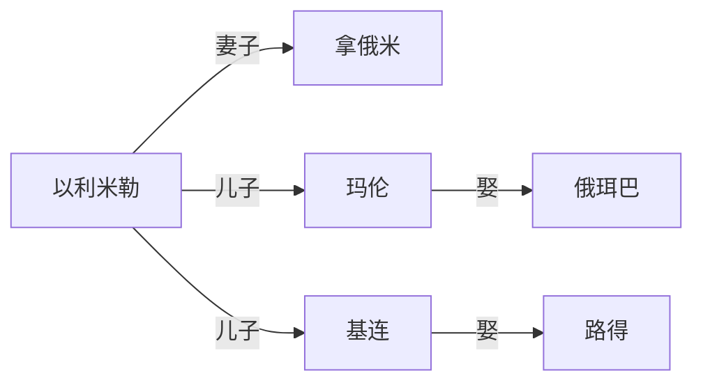

> ***Notice: 本内容以研究西方文化为目的，致力于通过对圣经文本的阅读，更加深刻地理解博尔赫斯、佩索阿等西方作家的作品，不涉及任何宗教内容，亦不推崇信仰宗教。主要面向除中国大陆、朝鲜、老挝、古巴、俄罗斯、越南之外的地区，未经允许，禁止复制传播文章内容，一切权利保留。***

---

路得记是一本比较短的经文,只有四章，故事情节非常简单。

先画一个人物关系图：

故事背景是以色列人闹饥荒，在饥荒中，以利米勒、玛伦、基连都死去了，这一家子留下了三个寡妇。

拿俄米劝两个儿媳妇回娘家改嫁她人，她们都放声痛哭，声称不愿意离开她，想要回到同胞的地方去。在拿俄米一番劝说下，俄珥巴选择了离开，但是路得坚持跟着自己的婆婆一起。

以利米勒有一个亲戚叫波阿斯，非常富有。路得要去田里捡麦穗，恰巧到了波阿斯的田，波阿斯非常照顾路得，并且吩咐手下人不要欺负她，高度赞赏了她的品德：

> 波阿斯回答她说：“你丈夫死后，你怎样对待婆婆，怎样离开了父母和家乡，跟陌生的民族一起生活，别人全都告诉我了。愿耶和华照你所做的奖赏你。你来投靠以色列的上帝耶和华，留在他的翅膀底下，愿他给你十足的赏赐“

拿俄米知道了之后，计划给路得找个归宿，所以告诉她波阿斯将会在脱谷场干活，她吩咐路得沐浴更衣，然后趁波阿斯睡觉的时候钻到他的被窝里去，路得照做了。波阿斯承诺会购赎路得一家的产业，第二天清晨，趁天没亮看不清人脸的时候，波阿斯给了她一些大麦让她回去了，然后就进城请长老见证赎了路得一家的土地，并宣布自己将会娶路得。

波阿斯最终娶了路得，生下来一个儿子取名叫俄备得：

> 俄备得是耶西的父亲，耶西是大卫的父亲。

而这里得大卫，就是后来的大卫王。

## 批注

这篇经文实际上就是讲了一个民间小故事，主要是提倡媳妇要孝顺公婆，即使丈夫去世也要不离不弃。

当然这里也并未像中国古代一样要求寡妇立贞洁牌坊终身守寡，耶和华的思想还是相对比较开放，他允许寡妇改嫁。

这里面路得改嫁的过程倒是令人印象深刻，主要特点就是半夜偷偷摸摸去和新任丈夫睡觉。这让我想到了红楼梦中的薛宝钗，宝钗和宝玉因为”金玉良缘”成婚后，没多久宝玉就出家了，宝钗成了寡妇。红楼梦没有完整版本，其中有一个癸酉本是近年互联网热门版本，在这个版本中，贾家败亡之后，贾雨村成了县官，并且还买了荣国府。宝钗遇到了贾雨村来找贾家人谈论公事，两人一拍即合，因此宝钗就坐着半夜三更的花轿改嫁给了贾雨村当小妾，这段情节和路得的故事可以说是神似了。这里不得不吐槽薛宝钗，她的“金玉良缘”简直就和《让子弹飞》里面的“谁是县长不重要，我只要做县长夫人”一样经典，谁是荣国府的主人她就跟谁金玉良缘，做不了大房就做小妾，实在是过于薄凉。

耶和华指派的士师参孙是恋爱脑，但是耶和华却是非常清醒的，根据原文：

> 波阿斯说：“女儿啊，愿耶和华赐福给你。你现在表现的忠贞之爱比起初的更大，因为不管是贫穷还是富有的年轻人，你都没有追随。 女儿啊，你放心。你说的一切，我都会为你做。全城的人都知道你是个贤德的女子。我是有购赎权，不过你还有一个关系更近的亲戚，他有权先购赎。今晚你就留在这里。明天早上，如果他愿意购赎你，那很好，就让他购赎；如果他不愿意，永活的耶和华可以作证，我一定购赎你。你就安心躺到早上吧。”

 他在这里着重强调了寡妇改嫁过程中的财产问题，路得改嫁的对象是一个富豪，同时是同族亲戚，改嫁之前波阿斯还专门处理了购赎土地的问题，根据"不管是贫穷还是富有的年轻人，你都没有追随"可以推测出波阿斯肯定是个糟老头子，所以这场改嫁最核心的问题是保证财产不流落到外人手中，同时路得的生活能够得到保障，而不是两者之间是否相爱。