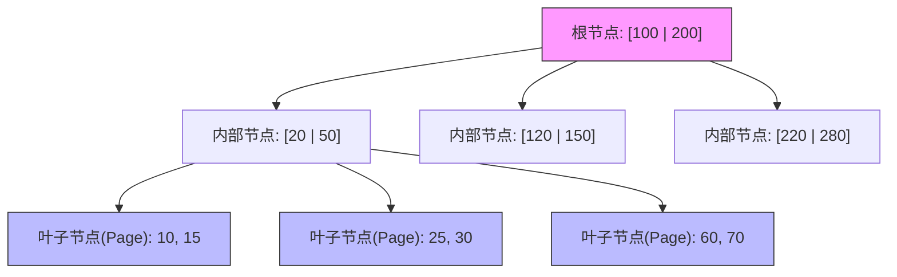
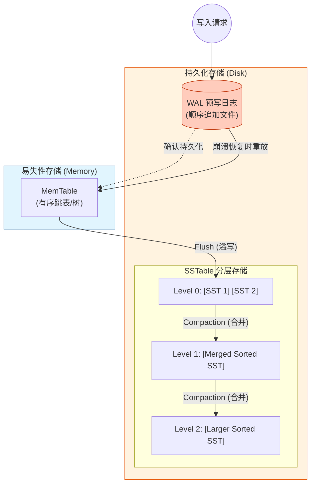

这是一份关于 **B 树**（B-Tree）与 **LSM 树**（Log-Structured Merge-Tree）基本原理的 Markdown 文档，包含了 Mermaid 流程图对比。

---

# 数据库存储引擎核心：B 树 vs LSM 树

在现代数据库中，存储引擎通常分为两大流派：以 **B 树**为代表的“原地更新”流派（如 MySQL InnoDB）和以 **LSM 树**为代表的“追加写入”流派（如 LevelDB, RocksDB, HBase）。

---

## 1. B 树 (B-Tree) - 读优化
B 树是一种多路平衡搜索树，旨在保持数据有序并允许在对数时间内进行查找、顺序访问、插入和删除。

### 基本原理
*   **结构**：由根节点、内部节点和叶子节点组成。每个节点包含多个 Key 和指向子节点的指针。
*   **原地更新 (Update-in-place)**：当数据修改时，直接定位到对应的磁盘页（Page）并覆盖原数据。
*   **磁盘友好**：节点大小通常与磁盘页（如 4KB 或 16KB）对齐，减少 I/O 次数。

### Mermaid 原理图

---

## 2. LSM 树 (LSM-Tree) - 写优化
LSM 树不是一棵严格的树，而是一种利用**顺序写**性能远高于**随机写**的存储架构。

### 基本原理
*   **MemTable**：在内存中维护一个有序结构（如跳表或红黑树）。
*   **WAL (预写日志)**：数据先写日志，防止宕机丢失。
*   **SSTable (Sorted String Table)**：内存写满后，将其作为有序文件“冲刷”（Flush）到磁盘。
*   **分层合并 (Compaction)**：由于数据是追加写的，旧数据不会被覆盖，后台会定期将多个小文件合并成一个大的有序文件，并清理旧版本。

### Mermaid 原理图

---

## 3. 核心对比

| 特性 | B 树 (B-Tree) | LSM 树 (LSM-Tree) |
| :--- | :--- | :--- |
| **数据更新方式** | 原地更新 (In-place Update) | 追加写入 (Append-only / Log-structured) |
| **主要存储介质** | 磁盘页 (Pages) | 内存表 + 分层有序文件 (SSTables) |
| **写性能** | 较慢（随机写、涉及页分裂和磁盘寻道） | **极快**（顺序写内存 + 顺序异步刷盘） |
| **读性能** | **极快**（点查询路径短，无需多文件合并） | 较慢（可能需要检索多个文件，配合布隆过滤器使用） |
| **空间碎片** | 存在（页内填充不满） | 存在（过期数据需等待合并时清理） |
| **典型应用** | 关系型数据库 (MySQL, PostgreSQL) | NoSQL/大数据 (Cassandra, RocksDB, TiDB) |

---

## 4. 总结与联系

*   **B 树** 就像一本**厚字典**：为了找一个词，你翻到对应的那一页直接看。如果词义变了，你拿橡皮擦掉在原位改写。
*   **LSM 树** 就像一堆**日记本**：新的记录永远写在当天的最后。为了找某个记录，你得先看今天的日记，没找到再翻昨天的。为了不让日记本太多，你会定期把几天的日记整理（Merge）成一本索引完美的书。

**为什么布隆过滤器常用于 LSM 树？**
正如文档之前提到的，LSM 树由于数据散落在不同的 SSTable 文件中，查询一个不存在的 Key 时可能需要扫描所有文件。**布隆过滤器**可以在访问磁盘前告诉你“这个 Key 绝对不在这些文件里”，从而极大地弥补了 LSM 树读性能的短板。